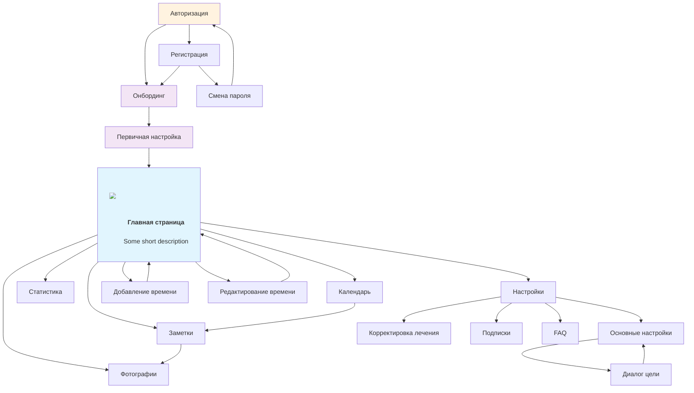

# Elainira - Приложение для отслеживания Элайнеров

## Обзор проекта

Elainira - это мобильное приложение для отслеживания времени ношения элайнеров во время ортодонтического лечения. Приложение помогает пользователям контролировать соблюдение режима ношения, анализировать прогресс лечения и вести дневник наблюдений.

## Структура документации

Данная документация содержит детальные технические задания для дизайнера мобильного приложения. Каждый документ описывает отдельную страницу или группу страниц с указанием назначения, компонентов, пользовательских сценариев и состояний экрана.

## Страницы приложения

### 🔐 Авторизация и регистрация

#### [Страница авторизации](authorization_page.md)
- **Назначение**: Точка входа в приложение для существующих пользователей
- **Основные функции**: 
  - Авторизация через Apple, Google, Facebook
  - Вход по email и паролю
  - Восстановление пароля
  - Переход к регистрации
- **Ключевые компоненты**: Логотип, способы авторизации, поля ввода, кнопки действий

#### [Страница регистрации](registration_page.md)
- **Назначение**: Создание нового аккаунта для новых пользователей
- **Основные функции**:
  - Заполнение персональных данных
  - Создание пароля с валидацией
  - Согласие с условиями использования
  - Подтверждение email
- **Ключевые компоненты**: Форма регистрации, валидация полей, чекбоксы согласия

### 🚀 Онбординг

#### [Страницы онбординга](onboarding_pages.md)
- **Назначение**: Знакомство новых пользователей с функциональностью приложения
- **Структура**:
  - **Страница 1**: Приветствие и обзор функций
  - **Страница 2**: Настройка уведомлений
  - **Страница 3**: Объяснение функции фотографирования прогресса
- **Ключевые компоненты**: Информационные карточки, индикаторы прогресса, настройки

### 🏠 Основной функционал

#### [Главная страница](main_page.md)
- **Назначение**: Центральный хаб для мониторинга прогресса лечения
- **Основные функции**:
  - Отслеживание времени ношения элайнеров
  - Управление статусом элайнера (надет/снят)
  - Таймауты для еды с отслеживанием времени
  - Смена элайнеров
  - Быстрые действия и статистика
- **Ключевые компоненты**: Круговой прогресс-индикатор, таймеры, кнопки управления, статистика

#### [Страница календаря](calendar_page.md)
- **Назначение**: Визуальное отслеживание прогресса лечения по дням
- **Основные функции**:
  - Календарная сетка с индикаторами активности
  - Детальная статистика выбранного дня
  - История событий и записей
  - Связь с заметками
  - Планирование смен элайнеров
- **Ключевые компоненты**: Календарная сетка, статистика дня, история событий, навигация

#### [Страница заметок](notes_page.md)
- **Назначение**: Ведение дневника лечения с систематизацией наблюдений
- **Основные функции**:
  - Создание и редактирование заметок
  - Категоризация записей (дискомфорт, прогресс, вопросы к врачу)
  - Поиск и фильтрация заметок
  - Подготовка к визитам к врачу
- **Ключевые компоненты**: Система создания заметок, категории, поиск, список заметок

#### [Страница статистики](statistics_page.md)
- **Назначение**: Детальный анализ прогресса лечения с визуализацией данных
- **Основные функции**:
  - Графики времени ношения и таймаутов
  - Статистика по элайнерам
  - Анализ соблюдения режима
  - Система достижений и мотивации
  - Экспорт отчетов для врача
- **Ключевые компоненты**: Графики, диаграммы, селектор периодов, достижения

#### [Страница добавления фото](photo_page.md)
- **Назначение**: Фотографирование и документирование визуального прогресса лечения
- **Основные функции**:
  - Создание фотографий улыбки и зубов
  - Категоризация снимков по типам
  - Редактирование и аннотирование фотографий
  - Привязка к этапам лечения и элайнерам
  - Подготовка материалов для врача
- **Ключевые компоненты**: Камера, инструменты редактирования, категории, метаданные

#### [Страница добавления времени](add_time_page.md)
- **Назначение**: Корректировка данных о времени вне элайнеров
- **Основные функции**:
  - Добавление недостающего времени
  - Исправление неточностей в записях
  - Обеспечение корректности статистики
- **Ключевые компоненты**: Поля ввода времени, диалоги выбора, сводная информация

#### [Страница редактирования времени](edit_time_page.md)
- **Назначение**: Корректировка записей о времени ношения элайнеров
- **Основные функции**:
  - Изменение временных интервалов
  - Удаление некорректных записей
  - Обеспечение точности данных
- **Ключевые компоненты**: Список записей, опции корректировки, функция удаления

#### [Страница смены пароля](password_reset_page.md)
- **Назначение**: Создание нового пароля после сброса
- **Основные функции**:
  - Ввод нового пароля с валидацией
  - Подтверждение пароля
  - Безопасная смена пароля
- **Ключевые компоненты**: Поля ввода пароля, валидация, кнопки действий

### ⚙️ Настройки

#### [Страницы настроек](settings/settings_drawable.md)
- **Назначение**: Настройка параметров лечения и приложения
- **Структура**:
  - **Страница 1**: Приветствие и начало настройки
  - **Страница 2**: Выбор типа элайнера
  - **Страница 3**: Ввод параметров лечения
  - **Страница 4**: Настройка напоминаний
  - **Страница 5**: Настройка резервного копирования
  - **Страница 6**: Дополнительные настройки
- **Ключевые компоненты**: Формы ввода, переключатели, валидация, индикаторы прогресса

#### [Диалог установки ежедневной цели](settings/set_daily_goal_dialog.md)
- **Назначение**: Настройка ежедневной цели ношения элайнеров
- **Основные функции**:
  - Установка минимального и максимального времени ношения
  - Персонализация целевых показателей
  - Круговой слайдер для настройки диапазонов
- **Ключевые компоненты**: Circular slider, перетаскиваемые маркеры, валидация

#### [Первичная настройка приложения](first_entry_settings.md)
- **Назначение**: Многошаговый процесс первичной настройки после онбординга
- **Основные функции**:
  - Ввод параметров лечения (количество элайнеров, дни ношения)
  - Выбор типа элайнера и текущего номера
  - Настройка напоминаний и резервного копирования
  - Создание индивидуального плана лечения
- **Ключевые компоненты**: Формы ввода, селекторы, валидация, индикаторы прогресса

## Ключевые особенности приложения

### 🎯 Специализация на элайнерах
- Отслеживание времени ношения с точностью до минут
- Управление таймаутами для еды
- Планирование смен элайнеров
- Анализ эффективности лечения

### 📊 Аналитика и мотивация
- Детальная статистика прогресса
- Визуализация данных через графики и диаграммы
- Система достижений и наград
- Мотивационные сообщения

### 📝 Документирование лечения
- Ведение дневника наблюдений
- Категоризация записей
- Подготовка к консультациям с врачом
- Фотографирование прогресса с категоризацией
- Визуальное отслеживание изменений улыбки

### 🔄 Интеграция и синхронизация
- Обмен данными с врачом
- Резервное копирование
- Синхронизация между устройствами
- Экспорт отчетов

## Принципы дизайна

### ✅ Что включать в описания:
- Функциональность и назначение элементов
- Расположение на экране
- Взаимодействие с пользователем
- Связи между элементами

### ❌ Что НЕ включать:
- Технические детали реализации
- Размерности, цвета, шрифты
- Точные позиции элементов
- Системные компоненты (статус-бар, время, батарея)
- Упоминания иконок (кроме логотипа приложения)

## Навигация между страницами

## Целевая аудитория

- Пациенты, проходящие ортодонтическое лечение элайнерами
- Пользователи, нуждающиеся в контроле соблюдения режима ношения
- Пациенты, желающие отслеживать прогресс лечения
- Пользователи, ведущие дневник лечения для консультаций с врачом

## Технические требования

- Мобильное приложение (iOS/Android)
- Офлайн-функциональность с синхронизацией
- Интеграция с камерой для фотографирования прогресса
- Система уведомлений и напоминаний
- Экспорт данных в различных форматах
